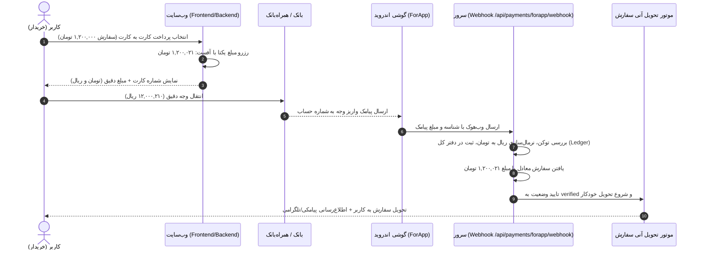

# راهنمای جامع و فنی پیاده‌سازی سیستم تایید خودکار کارت‌به‌کارت با ForApp

<Callout type="info" title="وضعیت پیاده‌سازی در همین ریپو">
این قابلیت در همین پروژه (بات پایتون) پیاده‌سازی شده و به‌صورت پیش‌فرض **خاموش** است. بخش‌های ۱ تا ۹ زیر مرجع اصلی معماری (پورت‌شده از نمونه Node.js) هستند؛ انتهای همین صفحه بخش «راه‌اندازی در PasarguardBot» را ببینید.
</Callout>

این مستند، راهنمای گام‌به‌گام و مرجع معماری (Architecture Blueprint) برای پیاده‌سازی سیستم تایید خودکار پرداخت‌های کارت‌به‌کارت در پروژه‌های بعدی است.

---

## ۱. ایده و معماری کلی (The Problem & Solution)

### چالش پرداخت کارت‌به‌کارت
درگاه‌های اینترنتی پرداخت (شاپرک) ممکن است با قطعی، مسدودسازی یا کارمزدهای بالا مواجه شوند. روش کارت‌به‌کارت ساده‌ترین روش پرداخت برای مشتریان ایرانی است، اما تایید دستی فیش واریزی توسط ادمین:
1. زمان‌بر و خطاپذیر است.
2. با فیش‌های جعلی و ادیت‌شده تهدید می‌شود.
3. در سفارش‌های فوری (مثل تحویل اتوماتیک گیفت‌کارت یا اکانت) تجربه کاربری بسیار ضعیفی ایجاد می‌کند.

### راهکار با نرم‌افزار ForApp
نرم‌افزار اندروید متن‌باز [erfjab/forapp](https://github.com/erfjab/forapp) روی یک گوشی اندرویدی (حاوی سیم‌کارت متصل به حساب بانکی فروشگاه) نصب می‌شود. به محض دریافت پیامک واریز از بانک:
1. متن پیامک را پارس می‌کند (مبلغ، بانک، کد پیگیری و...).
2. بلافاصله یک درخواست `POST Webhook` به سرور وب‌سایت شما ارسال می‌کند.

### راهکار حل چالش تطبیق (Matching Strategy: Unique Amount Offset)
پیامک‌های واریزی بانک شماره سفارش سایت شما را ندارند! بنابراین سرور چگونه بفهمد این واریز مربوط به کدام سفارش است؟
* **تکنیک Offset رندوم:** به هر سفارش یا تراکنش باز، یک مبلغ رندوم جزئی (مثلاً بین **۱ تا ۹۹۹ تومان**) اضافه می‌شود:
  $$\text{Payable Amount} = \text{Base Amount} + \text{Random Offset (1..999 Toman)}$$
* اگر مبلغ سفارش ۱,۲۰۰,۰۰۰ تومان باشد، مشتری موظف است دقیقاً **۱,۲۰۰,۰۲۱ تومان** (معادل ۱۲,۰۰۰,۲۱۰ ریال) واریز کند.
* در هر لحظه، هیچ دو سفارش یا شارژ کیف پول در صف پرداختی دارای مبلغ نهایی یکسان نخواهند بود (Collision Prevention).
* وقتی پیامک واریز ۱۲,۰۰۰,۲۱۰ ریال رسید، سیستم با دقت ۱۰۰٪ دقیقاً همان سفارش را پیدا کرده، تایید و تحویل آنی را آغاز می‌کند.



---

## ۲. طراحی دیتابیس (Database Schema)

سیستم به سه بخش در پایگاه‌داده نیاز دارد (در این پروژه از PostgreSQL استفاده شده است):

### ۱. ارتقاء جدول پرداخت‌های کارتی (`card_payments`)
دو ستون برای نگهداری مبلغ نهایی و مقدار رندوم آفست:
```sql
ALTER TABLE card_payments 
  ADD COLUMN IF NOT EXISTS payable_amount INTEGER,
  ADD COLUMN IF NOT EXISTS amount_offset INTEGER;

CREATE INDEX IF NOT EXISTS idx_card_payments_payable ON card_payments(payable_amount);
CREATE INDEX IF NOT EXISTS idx_card_payments_status ON card_payments(status);
```

### ۲. جدول دفتر کل پیامک‌های بانکی (`bank_deposits`)
هر پیامکی که از سمت گوشی ارسال می‌شود، ابتدا بدون از دست رفتن و به صورت **Idempotent** ذخیره می‌شود:
```sql
CREATE TABLE IF NOT EXISTS bank_deposits (
  id TEXT PRIMARY KEY,                 -- شناسه ارسالی ForApp یا UUID اختصاصی (جلوگیری از ثبت تکراری)
  raw_amount BIGINT,                   -- مبلغ خام خوانده‌شده از پیامک
  amount_toman INTEGER,                -- مبلغ تبدیل‌شده به تومان
  unit TEXT,                           -- rial یا toman
  sender TEXT,                         -- شماره یا سرشماره بانک (مثلاً Bank Melli یا 9896340)
  bank TEXT,                           -- نام بانک تشخیص داده شده
  body TEXT,                           -- متن کامل پیامک
  is_deposit BOOLEAN,                  -- آیا واریز است یا برداشت
  received_at_ms BIGINT,               -- تایم‌استمپ دریافت پیامک روی گوشی
  device TEXT,                         -- نام گوشی ارسال‌کننده (مثلاً Galaxy A54)
  attempt INTEGER NOT NULL DEFAULT 1,  -- شماره تلاش ارسال (برای Retry)
  is_test BOOLEAN NOT NULL DEFAULT false,
  status TEXT NOT NULL DEFAULT 'unmatched', -- 'unmatched' | 'matched_order' | 'matched_topup' | 'ignored'
  matched_order_id TEXT,               -- شناسه سفارشی که با این پیامک بسته شد
  matched_payment_id TEXT,
  matched_topup_id TEXT,
  created_at BIGINT NOT NULL
);

CREATE INDEX IF NOT EXISTS idx_bank_deposits_status ON bank_deposits(status);
CREATE INDEX IF NOT EXISTS idx_bank_deposits_amount ON bank_deposits(amount_toman);
CREATE INDEX IF NOT EXISTS idx_bank_deposits_created ON bank_deposits(created_at DESC);
```

### ۳. جدول شارژ کیف پول با کارت (`wallet_card_topups`)
اگر امکان شارژ کیف پول با کارت‌به‌کارت را هم دارید:
```sql
CREATE TABLE IF NOT EXISTS wallet_card_topups (
  id TEXT PRIMARY KEY,
  user_id TEXT NOT NULL,
  base_amount INTEGER NOT NULL,
  payable_amount INTEGER NOT NULL,
  amount_offset INTEGER NOT NULL DEFAULT 0,
  status TEXT NOT NULL DEFAULT 'pending', -- 'pending' | 'verified' | 'expired' | 'cancelled'
  deposit_id TEXT,
  created_at BIGINT NOT NULL,
  verified_at BIGINT,
  updated_at BIGINT NOT NULL
);

CREATE INDEX IF NOT EXISTS idx_wallet_topups_user ON wallet_card_topups(user_id);
CREATE INDEX IF NOT EXISTS idx_wallet_topups_status ON wallet_card_topups(status);
CREATE INDEX IF NOT EXISTS idx_wallet_topups_payable ON wallet_card_topups(payable_amount);
```

---

## ۳. ماژول محاسبات هسته (`lib/forapp.ts`)

این فایل قلب پردازش، تبدیل واحدها و الگوریتم رزرو آفست است:

```typescript
// lib/forapp.ts

export type ForappUnit = "rial" | "toman" | string | null | undefined;

export const FORAPP_OFFSET_MIN = 1;
export const FORAPP_OFFSET_MAX = 999;
const RESERVE_TRIES = 60;

/** خواندن کلیدهای احراز هویت وب‌هوک (امکان تعریف چند کلید برای چند گوشی با کاما) */
export function getForappApiKeys(env: Record<string, string | undefined> = process.env): string[] {
  const raw = env.FORAPP_API_KEYS ?? env.FORAPP_API_KEY ?? env.FORAPP_SECRET ?? "";
  return raw.split(",").map((k) => k.trim()).filter(Boolean);
}

/** مقایسه Constant-Time جهت جلوگیری از Timing Attack */
function safeEqual(a: string, b: string): boolean {
  if (a.length !== b.length) return false;
  let diff = 0;
  for (let i = 0; i < a.length; i++) diff |= a.charCodeAt(i) ^ b.charCodeAt(i);
  return diff === 0;
}

export function isValidForappKey(provided: string | null | undefined, allowedKeys: string[]): boolean {
  if (!provided || allowedKeys.length === 0) return false;
  const p = provided.trim();
  if (!p) return false;
  return allowedKeys.some((k) => safeEqual(p, k));
}

/** تبدیل مبلغ ریال به تومان (بیشتر پیامک‌های بانک ریال هستند و تقسیم بر ۱۰ می‌شوند) */
export function normalizeToToman(raw: number, unit: ForappUnit): number | null {
  if (!Number.isFinite(raw) || raw <= 0) return null;
  const u = (unit ?? "").toString().trim().toLowerCase();
  if (u === "toman" || u === "tmn" || u === "تومان") return Math.round(raw);
  if (u === "rial" || u === "irr" || u === "ریال" || u === "") {
    return Math.round(raw / 10);
  }
  return Math.round(raw);
}

/** ایجاد گزینه‌های احتمالی برای حالت‌هایی که بانک واحد را اشتباه تشخیص داده است */
export function forappCandidates(raw: number, unit: ForappUnit): number[] {
  const out: number[] = [];
  const primary = normalizeToToman(raw, unit);
  if (primary && primary > 0) out.push(primary);
  const rounded = Math.round(raw);
  if (rounded > 0 && !out.includes(rounded)) out.push(rounded);
  if (Number.isInteger(raw / 10)) {
    const divided = Math.round(raw / 10);
    if (divided > 0 && !out.includes(divided)) out.push(divided);
  }
  return out;
}

/** انتخاب آفست یکتا بدون تداخل با سایر مبالغ رزرو شده فعال */
export function reservePayableAmount(
  baseAmount: number,
  reservedPayables: Set<number> | number[],
  min = FORAPP_OFFSET_MIN,
  max = FORAPP_OFFSET_MAX,
  randomFn: () => number = Math.random
): { payable: number; offset: number } | null {
  const base = Number(baseAmount);
  const reserved = reservedPayables instanceof Set ? reservedPayables : new Set(reservedPayables);
  
  // ۱. تلاش تصادفی برای توزیع یکنواخت آفست‌ها
  for (let i = 0; i < RESERVE_TRIES; i++) {
    const offset = min + Math.floor(randomFn() * (max - min + 1));
    const payable = base + offset;
    if (!reserved.has(payable)) return { payable, offset };
  }
  // ۲. اسکن خطی در صورت وجود ترافیک بالا تا همیشه اسلات خالی پیدا شود
  for (let offset = min; offset <= max; offset++) {
    const payable = base + offset;
    if (!reserved.has(payable)) return { payable, offset };
  }
  return null;
}

export function coerceRawAmount(v: unknown): number | null {
  if (typeof v === "number" && Number.isFinite(v)) return v;
  if (typeof v === "string") {
    const n = Number(v.replace(/,/g, "").trim());
    if (Number.isFinite(n) && n > 0) return n;
  }
  return null;
}
```

---

## ۴. تخصیص و رزرو مبالغ یکتا هنگام ثبت سفارش

هنگامی که کاربر روش پرداخت کارت‌به‌کارت را انتخاب می‌کند، سرور تمام مبالغ در انتظار پرداخت فعلی (هم سفارش‌ها و هم شارژهای کیف‌پول با وضعیت `pending`) را کوئری می‌گیرد تا آفستی بدون تداخل تخصیص دهد:

```typescript
// lib/db/card-payments.ts

export async function reserveUniquePayable(baseAmount: number) {
  // ۱. استخراج مبالغ سفارش‌ها و کیف‌پول‌های منقضی‌نشده و پرداخت‌نشده
  const active = await sql<{ payable_amount: number }[]>`
    SELECT payable_amount FROM card_payments
    WHERE status IN ('pending', 'submitted') AND payable_amount IS NOT NULL
    UNION ALL
    SELECT payable_amount FROM wallet_card_topups
    WHERE status = 'pending'
  `;

  const takenSet = active.map((r) => Number(r.payable_amount));
  return reservePayableAmount(baseAmount, takenSet) ?? { payable: baseAmount, offset: 0 };
}

export async function getOrCreateCardPayment(orderId: string, amount: number) {
  const existing = await getCardPaymentByOrderId(orderId);
  if (existing?.payable_amount) return existing;

  const reserved = await reserveUniquePayable(amount);
  const now = Date.now();
  const id = `cpay_${orderId}_${now.toString(36)}`;

  const [row] = await sql<CardPaymentRow[]>`
    INSERT INTO card_payments (
      id, order_id, payment_method, amount, currency, status,
      payable_amount, amount_offset, created_at, updated_at
    ) VALUES (
      ${id}, ${orderId}, 'card', ${amount}, 'IRT', 'pending',
      ${reserved.payable}, ${reserved.offset}, ${now}, ${now}
    )
    RETURNING *
  `;
  return row;
}
```

---

## ۵. هندلر وب‌هوک سرور (`pages/api/webhook/forapp.ts`)

این اندپوینت آدرس دریافت اطلاعات از اپلیکیشن ForApp است.

### مراحل کلیدی هندلر:
1. **Health Check:** در صورت متد `GET`، سلامت سرویس و وضعیت ست بودن متغیرهای محیطی را برمی‌گرداند.
2. **Rate Limit:** محافظت در برابر اسپم یا حملات دیداس.
3. **احراز هویت:** بررسی هدرهای `X-API-Key`، `Authorization: Bearer` یا پارامتر کوئری.
4. **Idempotency:** ثبت پیامک در جدول `bank_deposits` با استفاده از `ON CONFLICT (id) DO UPDATE`.
5. **فیلتر واریز / برداشت:** نادیده گرفتن پیامک‌های کسر موجودی، خرید یا استعلام شارژ (`is_deposit: false`).
6. **تطبیق با سفارش‌ها و کیف پول:**
   * جستجو در `card_payments` با وضعیت `pending` و تطبیق `payable_amount`.
   * در صورت تطبیق: تغییر وضعیت به `verified`، ثبت کد پیگیری و اجرای پایپ‌لاین `completeOrderPayment`.
   * در صورت عدم تطبیق با سفارش: جستجو در `wallet_card_topups` و افزایش موجودی کیف پول کاربر (`creditWallet`).
7. **لاگ پیامک‌های بدون تطبیق (Unmatched):** ثبت وضعیت `unmatched` در دیتابیس و ارسال اعلان به تلگرام برای بررسی دستی ادمین.

```typescript
// pages/api/webhook/forapp.ts (خلاصه جریان تایید)

// ... اعتبارسنجی توکن و ثبت در جدول bank_deposits ...
const candidates = rawAmount ? forappCandidates(rawAmount, unit) : [];

// ۱. جستجوی سفارش
let matchedOrderPayment = null;
for (const candidate of candidates) {
  const payment = await getCardPaymentByPayableAmount(candidate);
  if (payment) {
    matchedOrderPayment = payment;
    break;
  }
}

if (matchedOrderPayment) {
  // تایید وضعیت پرداخت و اجرای تحویل خودکار
  const verified = await autoVerifyCardPaymentFromDeposit(
    matchedOrderPayment.id,
    body.code || deposit.id,
    sender
  );
  if (verified) {
    await completeOrderPayment({
      orderId: verified.order_id,
      paymentMethod: "card",
      paymentRef: body.code || deposit.id,
      adminId: "forapp",
      customDetail: `تایید خودکار توسط وب‌هوک پیامک بانک (${bank || "بانک"})`,
    });
    await markDepositMatched(deposit.id, {
      orderId: verified.order_id,
      paymentId: verified.id,
    });
    return res.status(200).json({ success: true, status: "matched_order" });
  }
}

// ۲. جستجوی شارژ کیف پول
// ... در صورت یافتن، متد creditWallet فراخوانی می‌شود ...
```

---

## ۶. تنظیمات اپلیکیشن اندروید (ForApp Setup Guide)

برای راه‌اندازی سمت گوشی اندروید:

1. **دانلود و نصب:** اپلیکیشن [ForApp APK](https://github.com/erfjab/forapp/releases) را دانلود و روی گوشی حاوی سیم‌کارت حساب بانکی نصب کنید.
2. **مجوزها (Permissions):**
   * دسترسی به دریافت پیامک (`SMS Read & Receive`).
   * **غیرفعال‌سازی بهینه‌سازی باتری (Battery Optimization: Unrestricted):** بسیار مهم است تا اندروید در زمان خاموش بودن صفحه، اپلیکیشن را در پس‌زمینه Kill نکند.
   * فعال‌سازی گزینه `Autostart` در گوشی‌های شیائومی/سامسونگ.
3. **ساخت مقصد (Destination) در ForApp:**
   * **URL:** `https://yourdomain.com/api/payments/forapp/webhook`
   * **Method:** `POST` (پیش‌فرض)
   * **Headers (پیش‌فرض خود اپ):**
     ```http
     X-API-Key: your_generated_secret_key_here
     Idempotency-Key: {{id}}
     ```
     همان کلیدی که در `.env` با `FORAPP_API_KEYS` ست کردید را به‌جای `your_generated_secret_key_here` بگذارید.
   * **Body (قالب JSON پیش‌فرض اپ — دست نزنید):**
     ```json
     {
       "id": "3fa85f64-5717-4562-b3fc-2c963f66afa6",
       "test": false,
       "sender": "98500012",
       "bank": "ملت",
       "body": "متن کامل پیامک",
       "amount": 12000210,
       "code": "210",
       "unit": "rial",
       "is_deposit": true,
       "received_at": "2026-10-10T12:00:00+03:30",
       "received_at_ms": 1791234567890,
       "attempt": 1,
       "device": "samsung SM-A546B"
     }
     ```
   * نکته‌ها از سورس خود اپ: فیلد `code` سه رقم آخر مبلغ است (فقط راهنما — تطبیق سرور با کل مبلغ انجام می‌شود)؛ `is_deposit` ممکن است `null` باشد (وقتی اپ نتواند تشخیص دهد) که سرور آن را کاندیدای واریز حساب می‌کند؛ `id` در تلاش‌های مجدد ثابت است پس ارسال تکراری هرگز دوبار شارژ نمی‌کند.
4. **تنظیم بانک‌ها:**
   * بانک‌های موردنظر (ملی، ملت، پاسارگاد، بلو، صادرات و...) را در منوی برنامه اضافه و فعال کنید.
5. **تست اتصال:** دکمه «ارسال آزمایشی» در برنامه را بزنید؛ یک پیامک با `test: true` و `sender: ForApp` می‌رسد و سرور آن را با وضعیت `test` در جدول `bank_deposits` ثبت می‌کند (بدون شارژ).
6. **رفتار تلاش مجدد اپ:** پاسخ `2xx` یعنی تحویل شد. خطاهای `429`/`5xx`/قطعی اینترنت با backoff (تا سقف ۳۰ دقیقه) دوباره تلاش می‌شوند؛ `403` یعنی کلید اشتباه است و دیگر تلاش نمی‌شود — پس اول کلید را چک کنید.

---

## ۷. نکات رابط کاربری (UI/UX Best Practices)

1. **نمایش دوگانه تومان و ریال:** بیشتر مشتریان مبلغ را به تومان می‌بینند اما همراه‌بانک‌ها (همراه بام، رسالت و...) مبالغ را به ریال دریافت می‌کنند. قرار دادن دو دکمه کپی سریع (کپی تومان / کپی ریال) خطای واریز مشتری را به صفر می‌رساند.
2. **آیکن‌ها و نشانگرها:**
   * بر اساس استانداردهای رابط کاربری، برای نشان دادن تایید خودکار و پردازش سریع، از آیکن `Zap` (⚡) از پکیج `lucide-react` استفاده کنید (هرگز از `Sparkles` برای پرداخت مالی استفاده نشود).
3. **تایمر معکوس (TTL):** به مشتری اعلام کنید که این مبلغ اختصاصی تا ۳۰ دقیقه معتبر است تا پس از انقضا، آفست آزاد شده و به کاربر دیگری اختصاص یابد.
4. **پنل مدیریت (Admin SMS Ledger):**
   * یک تب در پنل ادمین برای مشاهده زنده پیامک‌های دریافتی قرار دهید تا اگر مشتری به اشتباه مبلغ پایه (بدون آفست) را واریز کرد، ادمین بتواند با یک کلیک سفارش را به صورت دستی تطبیق دهد.

---

## ۸. متغیرهای محیطی مورد نیاز (`.env`)

```env
# کلیدهای امنیتی وب‌هوک ForApp (می‌توانید چند کلید با کاما جدا کنید)
FORAPP_API_KEYS=forapp_316191f820146d5c392bfbd8942f2669262e7d14a88a0f13

# تنظیمات کارت مقصد
CARD_TO_CARD_ENABLED=true
CARD_NUMBER=6037998112345678
CARD_HOLDER=نام صاحب حساب
BANK_NAME=بانک ملی ایران
```

---

## ۹. چک‌لیست بازتولید در پروژه‌های آینده

| ردیف | گام اجرایی | توضیح |
| :---: | :--- | :--- |
| ۱ | **مایگریشن دیتابیس** | ایجاد جداول `bank_deposits` و افزودن `payable_amount` به جداول پرداخت |
| ۲ | **کپی فایل هسته** | انتقال ماژول `lib/forapp.ts` به پروژه جدید |
| ۳ | **ساخت اندپوینت وب‌هوک** | ساخت `api/webhook/forapp` همراه با اعتبارسنجی `X-API-Key` |
| ۴ | **اتصال به موتور سفارش** | فراخوانی تابع تحویل محصول (`completeOrderPayment`) به محض تایید پرداخت |
| ۵ | **طراحی فرم پرداخت** | افزودن کامپوننت کارت بانکی و دکمه‌های کپی مبلغ تومان/ریال در صفحه سفارش |
| ۶ | **تنظیمات گوشی** | نصب ForApp روی گوشی، ست کردن کلید API و غیرفعال کردن بهینه‌سازی باتری |
| ۷ | **تست شبیه‌سازی** | اجرای تست اسکریپت شبیه‌سازی واریز ریال بانک و بررسی تایید خودکار سفارش |

## مرتبط

<Cards>
  <Card title="💳 تنظیمات درگاه" href="/docs/admin/gateway" />
  <Card title="🤖 اتوماسیون" href="/docs/admin/automation" />
  <Card title="💰 افزایش موجودی (دید کاربر)" href="/docs/user/balance" />
</Cards>

---

## راه‌اندازی در PasarguardBot (همین ریپو) [#pasarguardbot-setup]

پیاده‌سازی پایتون این راهنما فعال است؛ فقط باید روشن و تنظیم شود:

<Steps>
<Step>

### دیتابیس

مایگریشن `f4a1c9d2e7b3` را اجرا کنید تا جدول `bank_deposits` و ستون‌های `payable_amount` / `amount_offset` روی `transactions` ساخته شوند:

```bash
alembic upgrade head
```

</Step>
<Step>

### کلید وب‌هوک

در `.env` یک کلید تصادفی بگذارید (نمونه در `.env.example`):

```env
FORAPP_API_KEYS=forapp_change_me_1
```

</Step>
<Step>

### فعال‌سازی

در پنل مدیریت تلگرام → **💳 تنظیمات درگاه**، دکمه **⚡ تایید خودکار ForApp** را روشن کنید (معادل کلید `forapp_enabled` در `payment_settings`). تنظیمات تکمیلی در همان `payment_settings`:

| کلید | پیش‌فرض | معنی |
|------|---------|------|
| `forapp_enabled` | `false` | روشن/خاموش بودن رزرو مبلغ یکتا و تطبیق خودکار |
| `forapp_offset_min` / `forapp_offset_max` | `1` / `999` | بازه آفست رندوم (تومان) |
| `forapp_ttl_minutes` | `30` | اعتبار هر مبلغ رزروشده |

تا وقتی `forapp_enabled` خاموش است، فلوی کارت‌به‌کارت دقیقاً مثل قبل (رسید دستی) کار می‌کند.

</Step>
<Step>

### گوشی اندروید

اپ [ForApp](https://github.com/erfjab/forapp/releases) را روی گوشی سیم‌کارت بانکی نصب کنید و وب‌هوک را به این آدرس بدهید:

```
POST https://<your-domain>:<FASTAPI_PORT>/api/payments/forapp/webhook
X-API-Key: <همان کلید .env>
```

سلامت سرویس: `GET /api/payments/forapp/health`

</Step>
</Step>
</Steps>

### رفتار فلوی کاربر

1. کاربر مبلغ را وارد می‌کند → ربات یک مبلغ یکتای `base + offset` رزرو و همان را (تومان و ریال) نمایش می‌دهد؛ یک تراکنش `pending` با همان `payable_amount` از قبل ساخته می‌شود. پیام به کاربر صریح می‌گوید پرداخت خودکار تایید می‌شود و نیازی به ارسال رسید نیست.
2. کاربر دقیقاً همان مبلغ را کارت‌به‌کارت می‌کند → پیامک بانک به وب‌هوک می‌رسد → تطبیق با `payable_amount` → تایید خودکار و اطلاع‌رسانی.
3. **مبلغ شارژ = دقیقاً مبلغ واریزشده:** کیف پول به اندازه `payable` (نه مبلغ پایه) شارژ می‌شود؛ آفست فقط برچسب تطبیق است، نه کارمزد. بونوس هم روی همان مبلغ واریزشده حساب می‌شود.
4. **رسید بعد از تایید خودکار پذیرفته نمی‌شود:** اگر انتقال قبلاً خودکار تایید شده باشد، هم دکمه «ادامه» و هم ارسال عکس رسید با پیام «نیازی به ارسال رسید نیست» رد می‌شوند تا یک واریز دو بار شارژ نشود. رسید فقط برای مواردی است که تایید خودکار انجام نشده باشد.
5. اگر کاربر به‌جای واریز دقیق، رسید عکس بفرستد، همان تراکنشِ از قبل ساخته‌شده استفاده می‌شود (رکورد تکراری ساخته نمی‌شود) و مسیر تایید دستی/قانونی قبلی ادامه پیدا می‌کند.
6. پیامک‌های بدون تطبیق با وضعیت `unmatched` در جدول `bank_deposits` می‌مانند و در کانال لاگ کارت دستی اطلاع‌رسانی می‌شوند تا ادمین دستی بررسی کند.

---

## چک‌لیست پایلوت (اولین اجرای واقعی) [#pilot]

با یک مبلغ کوچک (مثلاً ۵۰٬۰۰۰ تومان) و سیم‌کارت واقعی:

<Steps>
<Step>

### سلامت و کلید

```bash
curl https://<domain>:<port>/api/payments/forapp/health
# {"ok":true,"configured":true}

# کلید اشتباه باید 403 بدهد:
curl -X POST https://<domain>:<port>/api/payments/forapp/webhook \
  -H 'X-API-Key: wrong' -H 'Content-Type: application/json' \
  -d '{"id":"probe-1"}'
```

</Step>
<Step>

### دکمه «ارسال آزمایشی» اپ

در ForApp دکمه تست را بزنید؛ باید در `bank_deposits` رکوردی با `status='test'` ثبت شود و موجودی هیچ کاربری تغییر نکند.

</Step>
<Step>

### واریز واقعی کوچک

1. `⚡ تایید خودکار ForApp` را در تنظیمات درگاه روشن کنید.
2. با یک اکانت تست، شارژ ۵۰٬۰۰۰ تومانی را شروع کنید و مبلغ یکتای نمایش‌داده‌شده را یادداشت کنید.
3. دقیقاً همان مبلغ را کارت‌به‌کارت کنید.
4. ظرف چند ثانیه: موجودی شارژ شده باشد، رکورد `bank_deposits` با `status='matched'` ثبت شده باشد و در کانال لاگ پیام `⚡ #کارت_به‌کارت_خودکار` آمده باشد.

</Step>
<Step>

### بازگشت

اگر چیزی درست کار نکرد: همان دکمه را خاموش کنید — فلوی کارت‌به‌کارت بلافاصله به حالت رسید دستی قبلی برمی‌گردد. تراکنش‌های `pending` مانده را دستی بررسی کنید.

</Step>
</Step>
</Steps>
