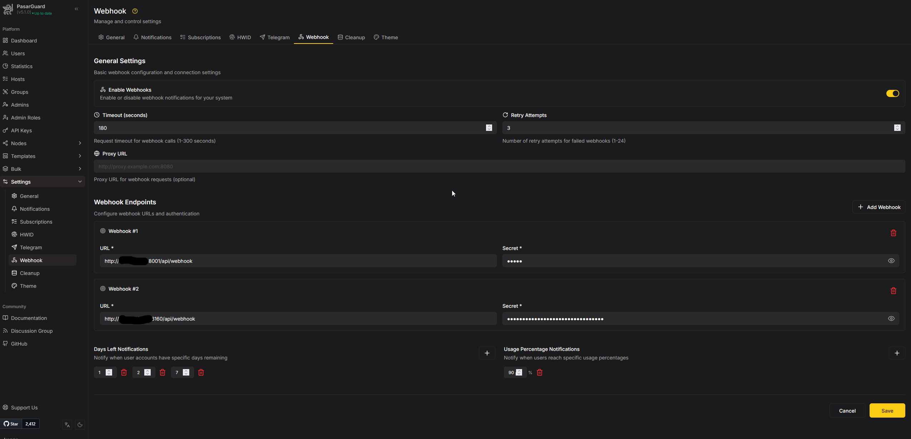

ربات می‌تواند وقتی حجم کاربر کم شد یا زمان سرویس رو به اتمام است، به کاربر پیام بدهد. برای هر پنل دو حالت دارید:

| حالت | علامت روی دکمه | معنی |
|------|----------------|------|
| **ربات (پیش‌فرض)** | 🤖 | خود ربات هر دقیقه از پنل لیست یوزرها را می‌گیرد و چک می‌کند |
| **وب‌هوک (پیشنهادی)** | 🔔 | خود پنل فقط برای همان یوزر رویداد می‌فرستد به ربات |

<Callout type="info" title="پیشنهاد">
حالت **وب‌هوک** را فعال کنید. سبک‌تر، دقیق‌تر و بدون فشار اضافه روی پنل است.
</Callout>

مرتبط با [نمای کلی منوی پنل‌ها](/docs/admin/panels).

---

## حالت ربات (پیش‌فرض — پیشنهاد نمی‌شود)

در این حالت ربات با کرون حدود **هر ۶۰ ثانیه** به پنل API می‌زند، یوزرها را می‌خواند و حجم/زمان را چک می‌کند.

مشکل‌ها:

- روی پنل‌های شلوغ **هر دقیقه کلی ریکوئست** به پنل می‌خورد
- بار CPU/API پنل بالا می‌رود
- فقط برای پنل‌هایی که وب‌هوک روشن **نیست** اجرا می‌شود

اگر همه پنل‌ها روی وب‌هوک باشند، این کرون برای آن‌ها رد می‌شود.

---

## حالت وب‌هوک (پیشنهادی)

پنل پاسارگارد وقتی رویدادی رخ دهد (مثلاً رسیدن به درصد مصرف یا روزهای باقی‌مانده)، **همان یوزر** را برای ربات می‌فرستد. ربات دیگر لازم نیست کل یوزرها را پول کند.

مزیت‌ها:

- بهینه‌تر و سبک‌تر
- فشار روی پنل خیلی کمتر
- هشدار نزدیک‌تر به لحظهٔ واقعی رویداد

---

## فعال‌سازی حالت وب‌هوک در ربات

1. وارد **پنل مدیریت** شوید.
2. **منوی پنل‌ها** → پنل مورد نظر را باز کنید.
3. دکمهٔ **📡 اطلاع‌رسانی** را بزنید تا روی **🔔** برود:
   - `📡 اطلاع‌رسانی (🤖)` = حالت ربات
   - `📡 اطلاع‌رسانی (🔔)` = حالت وب‌هوک
4. پیام تأیید شبیه این است: `وضعیت اطلاع‌رسانی به وب‌هوک 🔔`

اگر در ربات هنوز 🤖 باشد، رویدادهای وب‌هوک آن پنل نادیده گرفته می‌شوند و کرون ربات ممکن است دوباره پنل را چک کند.

---

## ست کردن وب‌هوک در پنل پاسارگارد

مسیر داخل پنل: **Settings → Webhook**



### ۱) گرفتن URL و Secret از سرور ربات

روی سرور ربات:

```bash
pasarguardbot
```

گزینهٔ **`8) Show webhook & URLs`**:

```text
URL:     http://IP_یا_دامنه:6160/api/webhook
Header:  x-webhook-secret: <مقدار WEBHOOK_SECRET>
```

همین دو مقدار را در پنل می‌گذارید. اگر دامنه دارید، به‌جای IP همان دامنه را استفاده کنید. جزئیات: [نصب](/docs/getting-started/install) و [منوی مدیریت سرور](/docs/getting-started/cli-menu).

### ۲) General Settings

| گزینه | پیشنهاد | توضیح |
|--------|---------|--------|
| **Enable Webhooks** | روشن (ON) | بدون این، هیچ رویدادی ارسال نمی‌شود |
| **Timeout (seconds)** | مثلاً `180` | مهلت پاسخ ربات (۱ تا ۳۰۰) |
| **Retry Attempts** | مثلاً `3` | تعداد تلاش مجدد اگر ارسال شکست بخورد |
| **Proxy URL** | خالی (معمولاً) | فقط اگر پنل برای دسترسی به ربات به پروکسی نیاز دارد |

### ۳) Webhook Endpoints

1. **+ Add Webhook** را بزنید.
2. در فیلد **URL** آدرس ربات را بگذارید، مثلاً:

```text
http://YOUR_SERVER_IP:6160/api/webhook
```

یا با دامنه:

```text
https://bot.example.com/api/webhook
```

3. در فیلد **Secret** دقیقاً همان مقدار `WEBHOOK_SECRET` از `.env` ربات را بگذارید (همان چیزی که گزینهٔ ۸ نشان می‌دهد).
4. اگر چند ربات دارید می‌توانید چند Endpoint اضافه کنید؛ برای یک ربات معمولاً یک Endpoint کافی است.
5. Endpoint اشتباه را با آیکون سطل‌زباله حذف کنید.

<Callout type="warn" title="پورت و مسیر">
پورت پیش‌فرض ربات **`6160`** است و مسیر باید دقیقاً **`/api/webhook`** باشد.  
پورت‌هایی مثل `8001` یا `8180` مربوط به ربات‌های دیگر/قدیمی‌اند؛ برای PasarguardBot از خروجی گزینهٔ ۸ استفاده کنید.
</Callout>

### ۴) Days Left Notifications

اینجا مشخص می‌کنید چند روز مانده به انقضا، پنل رویداد بفرستد.

1. روی **+** بزنید و عدد روز را وارد کنید.
2. نمونهٔ رایج: `7` و `2` و `1` (هفت روز، دو روز، یک روز مانده).
3. مقادیر اضافه را می‌توانید با ضربدر قرمز حذف کنید.

بدون حداقل یک عدد، هشدار «روز باقی‌مانده» از وب‌هوک نمی‌آید.

### ۵) Usage Percentage Notifications

اینجا آستانهٔ درصد مصرف حجم را ست می‌کنید.

1. روی **+** بزنید و درصد را وارد کنید (مثلاً `90`).
2. وقتی مصرف کاربر به آن درصد برسد، پنل رویداد می‌فرستد و ربات پیام کم‌حجم می‌دهد.
3. در صورت نیاز چند آستانه هم می‌توانید بگذارید (مثلاً `80` و `90`).

بدون حداقل یک درصد، هشدار کم‌حجم از وب‌هوک کار نمی‌کند.

### ۶) ذخیره

پایین صفحه **Save** را بزنید. بدون Save تنظیمات اعمال نمی‌شود.

---

## ترتیب درست برای کار کردن کامل

1. از `pasarguardbot` → گزینهٔ ۸، URL و Secret را بردارید  
2. در پنل: **Settings → Webhook** → Enable Webhooks = ON  
3. یک Endpoint با همان URL و Secret اضافه کنید  
4. Days Left (مثلاً ۱ / ۲ / ۷) و Usage Percentage (مثلاً ۹۰) را ست کنید  
5. **Save**  
6. در ربات، روی همان پنل **📡 اطلاع‌رسانی** را روی **🔔** بگذارید  
7. از سرور پنل، پورت `6160` سرور ربات باید در دسترس باشد (فایروال/امنیت)  

---

## چک‌لیست عیب‌یابی

| مشکل | بررسی |
|------|--------|
| هیچ پیامی نمی‌آید | Enable Webhooks روشن است؟ Save زده‌اید؟ |
| پنل به ربات نمی‌رسد | IP/دامنه و پورت `6160` درست است؟ فایروال باز است؟ |
| Secret اشتباه | مقدار Secret باید عین `WEBHOOK_SECRET` باشد |
| ربات رویداد را رد می‌کند | دکمهٔ اطلاع‌رسانی همان پنل روی 🔔 است؟ |
| فقط حجم/فقط زمان | آستانه‌های Percentage یا Days Left خالی نمانده باشد |

---

## نکات مهم

- **پیش‌فرض ربات** حالت 🤖 است؛ برای هر پنل جدا باید به 🔔 عوضش کنید.
- اگر چند پنل پاسارگارد دارید، در هر پنل وب‌هوک را جدا ست کنید (یا همان Endpoint ربات را در همه بگذارید).
- تا وقتی حتی یک پنل در ربات روی 🤖 باشد، کرون همچنان برای همان پنل‌ها هر دقیقه API می‌زند.
- متن پیام‌های اطلاع‌رسانی را از [متن‌ها و دکمه‌ها](/docs/admin/texts-keyboards) (بخش اطلاع‌رسانی / webhook) می‌توانید ویرایش کنید.
